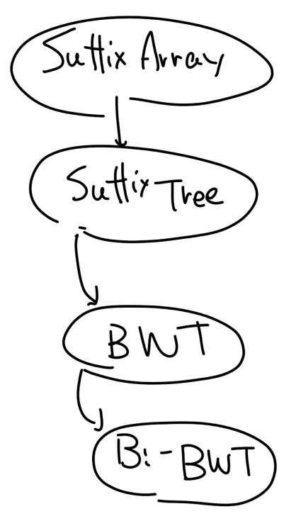

+++
title = "Bi-directional Burrows Wheeler Transformationまでの道（1）：Suffix array"
date = 2020-04-16
draft = true
tags = []
order = 0
weight = 0
aliases = []
template = "page.html"
[taxonomies]
tags = ["Suffix Array", "Algorithm", "Bioinformatics"]
categories = ["Bioinformatics"]
[extra]
+++


# これは何？

生物情報科学でごく希に出てくるデータ構造でbi-directional Burrows Wheeler Index(双方向バロウズウィーラー索引)というものがある。これは与えられた文字列内で繰り返し出てくる配列を高速に求められることと、やたらアルゴリズムがだるいことで知られている。

このシリーズはbi-directional Burrow Wheeler Indexを実装することを目的に、周辺のデータ構造を合わせて解説するシリーズにする予定であり、本稿はそれの第一回に当たる。

<!-- more --> 

# 参考文献

シリーズを通して

- Mäkinen, V., Belazzougui, D., Cunial, F. and Tomescu, A.I., 2015. Genome-scale algorithm design. Cambridge University Press.

を参考にしている。

# 本文

## はじめに

生物情報科学をやっていると、ある塩基配列（文字列）が、参照配列（文字列）のどこにあるのかを知りたい事がある。要するに、文章からある単語を探したいとか、文章同士を比較したいとかで、普通に考えればCtrl+Fで検索窓を開けばいいのだが、ドメイン固有の特徴して、

- 文章がやたら長い（3ギガ文字くらいある）
- 検索する文字列がやたら多い（100文字のクエリが1ギガ個くらい来る）

という制約があげられる。Knuth-Morris-Pratt(KMP)アルゴリズムをやっても、大体、文章の長さに比例した時間くらいかかる、全部会わせると、文章の長さxクエリ数に比例した時間がかかる。比例定数もそこそこ大きい。これはもうまるで駄目だ。宇宙が終わっても終わらない。佐藤君何してるの？　そんなんでお給料もらってていいの？　残業代くらい返上したら？というレベル[^1]だ。Aho-Corasicオートマトンも駄目だ。グラフが超巨大になってしまう。アホなのか？[^2]

そのような時に、bi-directional Burrows Wheeler Index(bi-BWI)は強力な武器になる。これ（とあといくつかのデータ構造と）を文書の長さに線形時間のアルゴリズムで構築すれば、**クエリに対して線形時間で**全文一致を検索できる。これは本当にできる。一瞬、「なぜ文章を全部読んでないのに全文一致が検索できるんだ？」と思うかもしれないが、最初に一回舐めているのでまあ問題ない。

この強力なデータ構造であるbi-BWIを理解するにあたっては、単方向のもの、つまりBurrows Wheeler Index(BWI) を理解する必要があり、これはSuffix Tree、Suffix Arrayと深く関わっている。Suffix Arrayの方が後に開発されたアルゴリズムだが、現在ではSuffix ArrayからSuffix Treeを理解することの方が主流だ。

何だって？

この非常に奥深い依存関係を図にすると次のようになる。


したがって、まずはSuffix Arrayの説明が必要になる。

## Suffix arrayとは

定義から述べる。

### Suffix Arrayの定義
長さ\\( n \\)の文字列 \\( T \\) の Suffix Array \\( SA(T)\\) とは、\\(SA(T)[i] \\)が、\\(T\\)の全ての接尾辞をソートしたとき、\\(i\\)番目に小さい接尾辞が\\(T\\)で始まる場所を返すような、\\(n\\)長の配列である。ただし\\(T\\)の最後の文字は、それ以外の文字より必ず小さいような文字であるとする。

何を言っているのか正直よく分からない。いきなり何の話ですか？

例を出すことにする。例えば、文字列\\( T \\) = ACGTACGTACTG$ を考える。長さ13の文字列である。また、$はACGTのどの文字よりも小さいとする。この例を考えると、まあ


> 長さ\\( n \\)の文字列 \\( T \\) の Suffix Array \\( SA(T)\\) とは、
\\(SA(T)[i] \\)が、\\(T\\)の全ての接尾辞をソートしたとき、\\(i\\)番目に小さい接尾辞が\\(T\\)で始まる場所を返すような、\\(n\\)長の配列である。ただし\\(T\\)の最後の文字は、それ以外の文字より必ず小さいような文字であるとする。

ここら辺は理解できる。ある文字列の接尾辞とは、いわゆる『途中から最後まで』なので、全ての接尾辞とは、

- ACGTACGTACTG$
- CGTACGTACTG$
- GTACGTACTG$
- TACGTACTG$
- ACGTACTG$
- CGTACTG$
- GTACTG$
- TACTG$
- ACTG$
- CTG$
- TG$
- G$
- $

である。これをソートすると、$が一番小さいことを考えて、

- $
- ACGTACGTACTG$
- ACGTACTG$
- ACTG$
- CGTACGTACTG$
- CGTACTG$
- CTG$
- G$
- GTACGTACTG$
- GTACTG$
- TACGTACTG$
- TACTG$
- TG$

となる。

> \\(i\\)番目に小さい接尾辞が\\(T\\)で始まる場所を返す

らしいので、例えば\\(0\\)番目に小さい接尾辞は$なので、12を返せばいい。2番目に小さいのはACGTACGTACTG$なので0を返す。要するに、上のリストで、それぞれの接尾辞が始まった場所を返すので、

```javascript
SA(T) = [12, 0, 4, 8, 1, 5, 9, 11, 2, 6, 3, 7, 10]
```
となる。

> 長さ\\( n \\)の文字列 \\( T \\) の Suffix Array \\( SA(T)\\) とは、\\(SA(T)[i] \\)が、\\(T\\)の全ての接尾辞をソートしたとき、\\(i\\)番目に小さい接尾辞が\\(T\\)で始まる場所を返すような、\\(n\\)長の配列である。ただし\\(T\\)の最後の文字は、それ以外の文字より必ず小さいような文字であるとする。

Suffix Array完全に理解した。

### 何がうれしいのか？

\\(T\\)=ACGTACGTACTG$の接尾辞をソートした配列をもう一度よく眺めると、

- $
- ACGTACGTACTG$
- ACGTACTG$
- ACTG$
- CGTACGTACTG$
- CGTACTG$
- CTG$
- G$
- GTACGTACTG$
- GTACTG$
- TACGTACTG$
- TACTG$
- TG$

ソートされているのが分かる[^3]。

さて、\\(T\\)の中に例えば、TACGが含まれるか調べたいと思ったとしよう。Knuth-Morris-Prattを使おうと思った人は出てきなさい。怒るから。ちがうでしょ。怒りました。

上のリストを見ると、これは二分探索をすれば判定できるのが分かるだろう。つまり、`(start, end)=(0, 12)`から初めて、リストの要素と`TACG`を比べればいい。要するに、\\(\log \\) 配列の長さ \\(\times \\) クエリ長 くらいの時間がかかる。これはナイーブな比較に比べて、まあそこそこ早くなっている。Suffix Array完全に使えるようになった。


### 実装

色々な理由から、実装はRustでやることにしよう。Rustは効率的で信頼できるソフトウェアを誰もが作れる言語です。ここまでならそんなに難しくはない。文字列の『文字』として何が来るか分からないので[^4]、型`T`としてジェネリクスを噛ませよう。
```rust
#[derive(Debug, Clone, Eq, PartialEq, Serialize, Deserialize, Default)]
pub struct SuffixArray<T: Ord + Clone + Eq> {
    inner: Vec<usize>,
    resource_type: std::marker::PhantomData<T>,
}
```
構築するためのメソッドはナイーブなものを使うことにしよう。つまり、まず入力を適当な数に変換して、それをソートすることにする。Rustには`sort_by`関数がある。Rust最高や！　Rustは効率的で信頼できるソフトウェアを誰もが作れる言語です。
```rust
impl<T: Clone + Ord + Eq> SuffixArray<T> {
    pub fn new_naive(input: &[T], alphabet: &[T]) -> Self {
        let alphabet: Vec<(usize, T)> = alphabet.iter().cloned().enumerate().collect();
        let mut input: Vec<u64> = input
            .iter()
            .map(|x| {
                alphabet
                    .iter()
                    .filter(|c| &c.1 == x)
                    .map(|c| c.0 as u64 + 1)
                    .nth(0)
                    .expect("the input contains a character not in the alphabet.")
            })
            .collect();
        input.push(0);
        let mut inner: Vec<_> = (0..input.len()).collect();
        inner.sort_by(|&i, &j| input[i..].cmp(&input[j..]));
        Self {
            inner,
            resource_type: std::marker::PhantomData,
        }
    }
}
```

最後に、文字列の探索のアルゴリズムが必要だ。これも簡単にかける。

```rust
impl<T: Clone + Ord + Eq> SuffixArray<T> {
    pub fn search(&self, input: &[T], query: &[T]) -> Option<usize> {
        let max = input.len();
        self.inner
            .binary_search_by(|&suf| {
                let end = (suf + query.len()).min(max);
                let suffix = &input[suf..end];
                suffix.cmp(query)
            })
            .ok()
            .map(|e| self.inner[e])
    }
}
```
理由は見ての通り、Rustには`binary_search_by()`があるためだ。書きやすい！ Rustは効率的で信頼できるソフトウェアを誰もが作れる言語です[^5]。

最後に、マッチを列挙する関数も書いておこう。これはやや真面目に書かないといけない。

```rust
impl<T: Clone + Ord + Eq> SuffixArray<T> {
    pub fn enumerate_matches(&self, input: &[T], query: &[T]) -> Option<&[usize]> {
        let max = input.len();
        let get_suf = |index: usize| {
            let suf_start = self.inner[index];
            let suf_end = (suf_start + query.len()).min(max);
            &input[suf_start..suf_end]
        };
        let compare = |index: usize| {
            let suffix = get_suf(index);
            suffix.cmp(query)
        };
        let (start, end) = binary_search_by(0, self.inner.len() - 1, compare)?;
        Some(&self.inner[start..end + 1])
    }
}
fn binary_search_by<F: Fn(usize) -> std::cmp::Ordering>(
    start: usize,
    end: usize,
    compare: F,
) -> Option<(usize, usize)> {
    // First, get the start location
    let start = if compare(start) == std::cmp::Ordering::Equal {
        start
    } else {
        let (mut start, mut end) = (start, end);
        while end - start > 1 {
            let center = (start + end) / 2;
            match compare(center) {
                std::cmp::Ordering::Less => start = center,
                _ => end = center,
            }
        }
        match compare(end) {
            std::cmp::Ordering::Equal => end,
            _ => return None,
        }
    };
    // Similary determine the end location.
    let end = if compare(end) == std::cmp::Ordering::Equal {
        end
    } else {
        let (mut start, mut end) = (start, end);
        while end - start > 1 {
            let center = (start + end) / 2;
            match compare(center) {
                std::cmp::Ordering::Greater => end = center,
                _ => start = center,
            }
        }
        match compare(start) {
            std::cmp::Ordering::Equal => start,
            _ => return None,
        }
    };
    Some((start, end))
}
```
やや冗長になったが、色々テストが書きやすいので、バグりやすい二分探索を外に出している。外に出して！（？）　性的な要素は今のところ一切無い。


### 問題

ところで、SuffixArrayの構築にも 配列の長さ \\(\times \log \\) 配列の長さ 回、接尾辞同士の比較が必要になる。接尾辞同士の比較は最悪で配列長くらいかかってしまうので、これは正直言って実用上はかなり遅い。検索にも、\\(\log \\) 配列の長さ \\(\times \\) クエリ長はまだ遅すぎて使えない。メモリのフットプリントも無視できないところだ。

次回は、まずSuffix Arrayの構築を入力に対して線形時間に行うアルゴリズムを紹介することにする。一瞬、\\(n\\)長の配列が\\(n\\)に対して線形時間でソートが終わるのが非直感的に思われるが、実はそうではないことも含めて解説することにする。

ちなみに[この図](./dependencies_full.png)は、依存関係を表すときに最初に使おうと思っていたが、あまりに冒涜的なので使うのをやめた図だ。クリックでリンクが開く。

-------------------------

[^1]: こういうことを言われたら労基に駆け込もう

[^2]: エイホである。

[^3]: ソートされているので。

[^4]: ASCII文字以外の文字もあり、『有限集合の要素の列』の事を『文字列』ということもできる。この世は広い。

[^5]: Rustは効率的で信頼できるソフトウェアを誰もが作れる言語です。