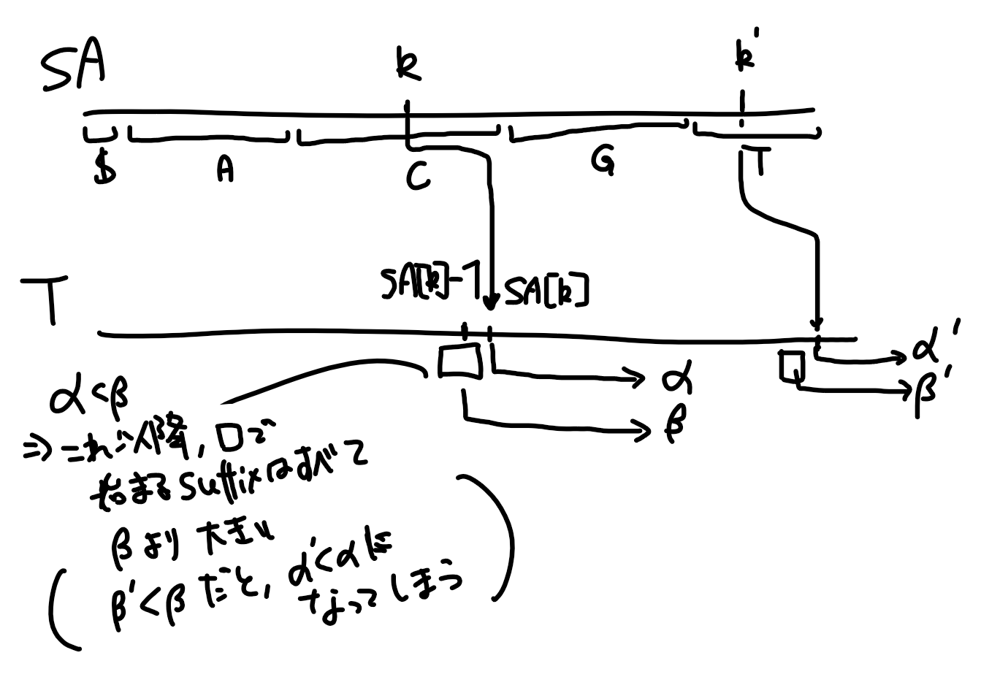

+++
title = "Bi-directional Burrows Wheeler Transformationまでの道（1）：Suffix array の線形時間構築"
date = 2020-04-16
draft = false
tags = []
order = 0
weight = 0
aliases = []
template = "page.html"
[taxonomies]
tags = ["Suffix Array", "Algorithm", "Bioinformatics"]
categories = ["Bioinformatics"]
[extra]

+++


# これは何？

生物情報科学でごく希に出てくるデータ構造でbi-directional Burrows Wheeler Index(双方向バロウズウィーラー索引)というものがある。これは与えられた文字列内で繰り返し出てくる配列を高速に求められることと、やたらアルゴリズムがだるいことで知られている。

このシリーズはbi-directional Burrow Wheeler Indexを実装することを目的に、周辺のデータ構造を合わせて解説するシリーズにする予定であり、本稿はそれの第2回に当たる。

<!-- more --> 

# 参考文献

シリーズを通して

- Mäkinen, V., Belazzougui, D., Cunial, F. and Tomescu, A.I., 2015. Genome-scale algorithm design. Cambridge University Press.

を参考にしている。

今回は特に、

- Nong, Ge & Zhang, Sen & Chan, Daricks Wai Hong. (2009). Linear Suffix Array Construction by Almost Pure Induced-Sorting. Proceedings of the Data Compression Conference. 193-202. 10.1109/DCC.2009.42. 

も参考にしている。

# 本文

## はじめに

さて、[前回](./../suffix_array1)はSuffix Arrayの定義と、それを使ったクエリの検索をやった。実装して（実験をして）みると、色々な問題があることが分かる。特に、Suffix Arrayを構築するのにやたら時間がかかるのは問題だ。ナイーブに実装をすると、

- 接尾辞同士の比較に 入力長に線形の時間がかかる（例えばAAAAA....AAAAなど）。
- 接尾辞は入力長に線形個数存在する
- 要素ごとの比較ベースの方法では、\\( \Omega(n \log n c) \\) かかる。ここで\\(n, c\\)は要素数と一回の比較にかかる時間。

よって、雑にやると入力長の二乗以上の時間がかかる。こんなアルゴリズムを提出したらとんでもないことになる。

したがって、SuffixArrayを早く構築したいと思うが、そんなことができるのだろう？　上の議論はかなり『限界』感がある……。

直感的に言えば、文字列の接尾辞同士にはある程度の関係があることが、高速なるアルゴリズムの構築を可能にしている。考えてみてほしいが、ある接尾辞\\(T[i..]\\)が

- ACG....

となっていて、別の接尾辞\\(T[j..]\\)が

- AC....

となっていたとする。このとき、\\(T[i..]\\)と\\(T[j..]\\)の比較をしてしまえば、\\(T[i+1..]\\)と\\(T[j+1..]\\)との比較はしなくてもいいのが分かる。というのも、\\(T[i..]\\)と\\(T[j..]\\)の最初の文字が一致しているためだ。

この事実を突き詰めて、『各接尾辞の最初の\\(2^k\\)文字がソートされた』配列が手に入ったとしよう。要するに、各接尾辞はすごく長いかもしれないが、とにかく最初の\\(2^k\\)まで見てソートするという訳だ。\\( T \\) = ACGTACGTACTG$に対しては、

- AC
- CG
- GT
- TA
- AC
- CG
- GT
- TA
- AC
- CT
- TG
- G$
- $

をソートして\\(S_1\\)とする。結果をどう保持するかだが、\\(i\\)にアクセスすると、\\(i\\)番目の要素のランク（"ランキング"といったときのランクと同じ意味）が手に入るとしよう。たとえば、上の配列で言えば、CGは重複を含めて4番目に小さいので、\\(S_1[1] = 4\\)である。簡単！

こうすると、実は

- 0:ACGT
- 1:CGTA
- 2:GTAC
- 3:TACG
- 4:ACGT
- 5:CGTA
- 6:GTAC
- 7:TACT
- 8:ACTG
- 9:CTG$
- 10:TG$
- 11:G$
- 12:$

のソートが\\(O(n \log n )\\)で出来るようになる。というのも、例えば、\\(3\\)番目の要素と\\(7\\)番目の要素の比較をするとき、\\(S_1[3]\\)と\\(S_1[7]\\)を比べれば、最初の二文字の比較が出来るし、残念ながら\\(S_1[3]\\)と\\(S_1[7]\\)が同じだった場合 -- 今回は特にその場合なのだが -- \\(S_1[3+2]\\)と\\(S_1[7+2]\\)を比べてやれば、後半二文字の比較が出来るからだ。要するに、前半も後半も既に比較済みなので、たかだか四回配列を読めば比較が出来る。簡単！

これがいわゆるLarsson-定兼のアルゴリズムというやつだが、これが『はじめに』に書いてあることからも分かるように、シリアスな業務において、`git add . && git commit -m "implementing a faster new method on Suffix Array ～Larsson-定兼で実装しちゃいました～" && git push origin master` するやいなや[^1]、メンターが飛んできて本体に2点与えてくる可能性まである[^2]。わかりやすく日本語で言うと、もっと早いアルゴリズムがあると言うことだ。

それがSuffix Array Induced Sortingと呼ばれるアルゴリズムで、漸進的な改良の末に人類が到達した、相当洗練されたアルゴリズムの一つだ。

[^1]: `master`で開発するな！

[^2]: メンターは瞬速と飛行を持つ青の2/1の人間・工匠クリーチャー・トークンである。


## 内容：Suffix Arrayの線形時間構築

さて、アルゴリズムを考えるとき、「あるところまで構築できたとしよう」と仮定することがよくある。これは要するに『今から再帰的に作るからな！』という意味である。マージソートで言えば、突然、『配列を半分に切って、それぞれがソートできたとする』などと言い始めるのがこれに当たる。正直言って、アルゴリズムの勉強を始めたときは、この教科書を書いたやつは頭ヤバいんじゃないかと思ったものだったことだよ[^3]。

それはともかくとして、Suffix Arrayが\\(k\\)番目まで作れたとしよう。つまり、\\(n\\)長の文字列\\(T\\)に対して、それのSuffix Array\\(SA\\)が\\(k \leq n \\)まで構築できているとする。残りは`None`だか`Inf`だかが入っている。

このとき、Suffix Arrayは先頭の文字でバケットに分けられていることに注意しよう。つまり、\\( T \\) = ACGTACGTACTG$に対しては、接尾辞をソートすると

- $
- ACGTACGTACTG$
- ACGTACTG$
- ACTG$
- CGTACGTACTG$
- CGTACTG$
- CTG$
- G$
- GTACGTACTG$
- GTACTG$
- TACGTACTG$
- TACTG$
- TG$

となり、先頭の文字を見てみると、$->A->C->G->Tと変わっていくのが分かる。これは当然そうなる。そうなってないとソートとは何だったのかという話になる。このように先頭の文字で区切った区分けを『文字Aのバケット』などと言うことにする。

このとき、\\(T[SA[k] -1..]\\)という接尾辞を考えてみよう。さらに、この接尾辞の先頭の文字を\\(c = T[SA[k]-1]\\)とする。

さて、\\(T[SA[k]-1..]\\)は現在構築中のSuffix Arrayのどこに入るだろうか？

まず、\\(T[SA[k]-1..]\\)が\\(T[SA[k]..]\\)より小さい場合、もう既に入っている。そうでない場合、答えは『文字\\(c\\)のバケットを上から見ていったとき、最初に出会う空のスロット』だ。これはある意味当然で、

1. これまでに\\(T[SA[k]-1..]\\)より大きく、\\(c\\)で始まる接尾辞は登録されていない。というのも、もしそうなら、それを一つ進めた接尾辞は\\(T[SA[k]..]\\)より大きくなってしまう。\\(k\\)番目まで作れたとは何だったのか。
2. これ以降に、\\(T[SA[k]-1..]\\)より小さく、\\(c\\)で始まる接尾辞は登録されない。そういう接尾辞があると、それを一つ進めた接尾辞の方が\\(T[SA[k]..]\\)より小さくなってしまう。\\(k\\)番目まで作れたとは何だったのか。

だからだ。何言ってるのか正直よく分からないので、図にしてみる。




君たちもそろそろ馬鹿フィギュアに慣れ、もはや馬鹿フィギュアがないと物足りなくなってきたんじゃないだろうか？　

さて、この『\\(T[SA[k]-1..]\\)を登録する』が定数時間で出来るためには、\\(T[SA[k]-1..]\\)と\\(T[SA[k]..]\\)の比較と、バケットの空のスロットを探すのが定数時間で出来る必要がある。

前者は事前に計算しておけばよく[^4]、後者は各文字に対して空のスロットの位置を指す変数を作っておけばいい。簡単！　この『SuffixArrayを順に舐めながら、\\(T\\)において隣接する接尾辞のランクを決めていく』作業のことをInduced sortingと言うことにする。これは小さい方からやっているので、順（Forward）induced sortingと呼ぼう。

しかし、上の更新は実はそんなに素晴らしくはない。というのも、\\(SA[k]\\)を処理しても、\\(SA[k+1]\\)が埋められるかは分からないからだ。あかん、 Larsson-定兼に比べるとこのアルゴリズムはカスや。

ならどうするかというと、**とにかく動くのに必要な場所だけ全部埋めればいいんでしょ**というマッチョ的な解決策をとることにする。つまり、Induced sortingでは埋められない場所を最初に全部埋めておくという手法だ。

まず、上の更新から分かるように、一つ後の接尾辞よりも大きい接尾辞（『大きい』接尾辞と言うようにしよう）は、上記の更新をやっていくうちにSuffix Arrayの場所を決定できる。したがって、一つ後の接尾辞よりも小さい接尾辞（『小さい』接尾辞）の場所を決定できればいい。次のようにはっきり言ってもいいだろう。

> 『小さい』接尾辞が全て埋められているとき、Forward induced sortingを行えば、Suffix Arrayが構築できる。

逆も又しかりである。つまり、

> 『大きい』接尾辞が全て埋められているとき、Reverse induced sorting を行えば、Suffix Arrayが構築できる。

ところで、よく考えると、上の二つから、『任意の文字\\(c\\)について、Suffix Arrayの\\(c\\)のバケットでは『大きい』接尾辞が並んで、その後で『小さい』接尾辞が並ぶ』という事が分かる。わかりやすく言うと、文字Aのバケットを見ると、


LLLLLLSSSSSSS

などと並んでいる（Lは『大きい』接尾辞、Sは『小さい』やつ）。この事実は直接、示せもする。

そうなると、決めておくべき要素はさらに減って、\\(T\\)において、『大きい』接尾辞Lと『小さい』接尾辞Sが

LSSSLLLSSSLLSSLLSS

などと並んでいたら、

L**S**SSLLL**S**SSLL**S**SLL**S**S

太字の『小さい』接尾辞がソートできていたら、

1. 太字の『小さい』接尾辞を使ってForward induced sortingする（LがとにかくSuffix Arrayに正しく並ぶ。Sは全く並ばない）
2. Sの接尾辞を全て取り去って、Lを使ってReverse Induced sortingする（Lは埋まっている。Sも正しく埋められる）。

となる。なんと、各連続するSの中で、一番左側（LeftMostS:LMS）の場所が分かればいいことになった。


もっと言えば、LMSは正しい位置にある必要すらなく、順序が分かっていれば何でもいい（2番目のReverse Induced sortingの前に全て取り除くから）。したがって、


> LMSがソートできれば線形時間で構築できる

ことが分かる。だが、LMSをソートすると言ったって、どれほどあるかは定かではない（実は最悪の場合、入力長の半分くらいのLMSがでてくる）。だんだん抽象的になってきついので、ここで\\( T \\) = ACGTACGTACTG$にたいしてLとSを計算してみると、

```
SSSTSSSLSSLLS
ACGTACGTACTG$
0000100010001　<- LMSかどうかのビット。最初のSはフラグを立てなくてもアルゴリズムは回る（本当）
```

LMSが三個くらいしかないので、まあ普通にソートしてもいいが……。


ここで突然（ここが原著論文のやたらすごいところだ）ひらめくのが、『LMSをソートするのと、LMS同士の間の文字列を『文字』だと思って、Suffix Arrayを作るのは同じ』だと言う事実だ。何を言ってるのか分からないが、要するにLMSをソートするのは、その場所から始まるSuffixをソートすることで、**それだったらLMSの間の文字とかどうでもいいじゃん。一つの文字だと思っていいじゃん**ということだ。LMS（の場所から始まる接尾辞）同士の比較をするとき、AとかCとかはどうでもよく、『そこから次のLMSまでの文字列』同士の比較の方が大切なのだ。

じゃあやるかと思うと、実はまだそう簡単ではない。二つのLMS同士の間の文字列を新しい『文字』だと思うと言っても、どう順序をつけていいか分からないからだ。確かに、上の例で言えば、新しい『文字』は

- ACGTA -> 0
- ACTG$ -> 1

の二つであり、二つのLMS

- ACGTACTG$
- ACTG$

の大小関係は、

01$

のSuffix Array（再帰的に作る！）

- $
- 01$ <- 最初のLMSを表す
- 1$   <- 二番目のLMSを表す

から分かるように、最初のやつの方が二番目より小さいことが分かるが、おまえいったい

- ACGTA -> 0
- ACTG$ -> 1

このマッピングはどこから手に入れたんだよ、という話になる。頭から二つのLMSの間の文字列を取ってきて、順に0,1,...とつけるのは完全におかしい。**T**における二つのLMSの間の文字列は、どんな感じに出てくるか全く不明だ。

ではどうするかというと、驚くべき事に、次の事実が手に入る。

> LMSをSuffix Arrayの各文字列のバケットの一番最後から順に入れて、Forward induced sorting, Reverse induced sortingをすると、LMS間の文字列はソートされて並ぶ。つまり、この『うそSuffix Array』を舐めながら、LMS間の文字列が出てきた順に0,1,...と番号を振れば、上記のマッピングが手に入る。

これは本当だ。証明は本質的に、Induced sortingが、SやLの切れ目までの情報しか使わないことによる。私はだんだん疲れている。いいんだよテストが通れば。

結局、次のようにアルゴリズムが作れる

1. LMSの位置にフラグを立てる
2. 空のベクターを作る。`T` 内の文字を数えて、バケットがどこからどこまでかマークする。
3. LMSを各バケットの**最後から**順に詰める。順でなくてもいい。
4. Forward induced sortingをして、LMSだった要素を捨てて、Reverse Induced sortingをする。
5. こうすると、この『うそSuffix Array』を見ながら、二つのLMS間の文字列を取り出してきて、0,1,...と新しい文字にマッピングできる。
6. マッピングが衝突しないと、ソートは簡単にできる。衝突していたら、再帰的にSuffix Arrayを作る。
7. LMS間の文字列のソートが出来るので、LMSのソートも出来る
8. 再びベクタをアロケートして、LMSを入れて、Forward/Reverse induced sortingをする。
9. テストを通す

となる。私が極めて投げやりな気持ちになっているのが分かるだろうか？　実装を見ろ実装を。おれも他人の実装を眺めて勉強した。おまえもそうしろ[^5]。

## 実装

昨日つくったSuffix Arrayに追加で`impl`ブロックを書けばよい。
```rust
impl<T: Clone + Ord + Eq> SuffixArray<T> {
    pub fn new(input: &[T], alphabet: &[T]) -> Self {
        // Renaming input into alphabetically order.
        let alphabet: Vec<(usize, T)> = alphabet.iter().cloned().enumerate().collect();
        let mut input: Vec<u64> = input
            .iter()
            .map(|x| {
                alphabet
                    .iter()
                    .filter(|c| &c.1 == x)
                    .map(|c| c.0 as u64 + 1)
                    .nth(0)
                    .expect("the input contains character not in the alphabet.")
            })
            .collect();
        input.push(0);
        // alphabet + sentinel character.
        let inner = Self::induced_sorting(input, alphabet.len() + 1);
        Self {
            inner,
            resource_type: std::marker::PhantomData,
        }
    }
    // これがメインの構築アルゴリズムだ。
    fn induced_sorting(input: Vec<u64>, alphabet_size: usize) -> Vec<usize> {
    	// LMS位置を決める-> Suffix Arrayを再帰的に作る->二回目のInduced sortingである。
        let lms_position = Self::first_induce(&input, alphabet_size);
        let sa_of_lms = Self::construct_sa_of_lms(&lms_position, &input);
        Self::second_induce(&input, alphabet_size, &sa_of_lms)
    }
    fn first_induce(input: &[u64], alphabet_size: usize) -> Vec<(usize, usize)> {
        let (is_large, is_lms) = Self::determin_large_small(input);
        // If input.len(), it is empty.
        let mut approx_sa: Vec<usize> = vec![input.len(); input.len()];
        let mut bucket = Self::count_bucket(input, alphabet_size);
        // Set Small suffices.
        let mut position_of_samll_suffix = vec![false; input.len()];
        for (idx, (&c, &is_large)) in input.iter().zip(is_large.iter()).enumerate() {
            if !is_large {
                approx_sa[bucket[c as usize]] = idx;
                position_of_samll_suffix[bucket[c as usize]] = true;
                if bucket[c as usize] > 0 {
                    bucket[c as usize] -= 1;
                } else {
                    assert_eq!(c, 0);
                }
            }
        }
        // Forward path.
        let mut bucket = Self::count_bucket_front(input, alphabet_size);
        for position in 0..input.len() {
            // If approx_sa[pos] == 0, the previous suffix is 0, and it is already added.
            if approx_sa[position] != input.len() && approx_sa[position] > 0 {
                let prev_position = approx_sa[position] - 1;
                if is_large[prev_position] {
                    let c = input[prev_position];
                    approx_sa[bucket[c as usize]] = prev_position;
                    bucket[c as usize] += 1;
                }
            }
        }
        // Remove all the element of small suffices.
        approx_sa
            .iter_mut()
            .zip(position_of_samll_suffix)
            .filter(|&(_, b)| b)
            .for_each(|(x, _)| {
                *x = input.len();
            });
        // Reverse path.
        let mut bucket = Self::count_bucket(input, alphabet_size);
        for position in (0..input.len()).rev() {
            if approx_sa[position] != input.len() && approx_sa[position] > 0 {
                let prev_position = approx_sa[position] - 1;
                if !is_large[prev_position] {
                    let c = input[prev_position];
                    approx_sa[bucket[c as usize]] = prev_position;
                    bucket[c as usize] -= 1
                }
            }
        }
        approx_sa[0] = input.len() - 1;
        approx_sa
            .into_iter()
            .filter(|&x| is_lms[x])
            .map(|start| {
                let mut end = start + 1;
                while end < input.len() && !is_lms[end] {
                    end += 1;
                }
                (start, (end + 1).min(input.len()))
            })
            .collect()
    }
    // バケットに分けるのも、Foward用とReverse用に二つ必要である。
    fn count_bucket(input: &[u64], alphabet_size: usize) -> Vec<usize> {
        let mut bucket = vec![0; alphabet_size];
        for &x in input {
            bucket[x as usize] += 1;
        }
        bucket
            .into_iter()
            .fold((vec![], -1), |(mut bucket, mut acc), count| {
                acc += count as i64;
                assert!(acc >= 0);
                bucket.push(acc as usize);
                (bucket, acc)
            })
            .0
    }
    fn count_bucket_front(input: &[u64], alphabet_size: usize) -> Vec<usize> {
        let mut bucket = vec![0; alphabet_size];
        for &x in input {
            bucket[x as usize] += 1;
        }
        bucket
            .into_iter()
            .fold((vec![], 0), |(mut bucket, acc), count| {
                bucket.push(acc);
                (bucket, acc + count)
            })
            .0
    }
    // これが再起の部分である。
    fn construct_sa_of_lms(lms_position: &[(usize, usize)], input: &[u64]) -> Vec<usize> {
        let mut current_idx = 0;
        let new_array: Vec<_> = {
            let max = input.len() as u64;
            let mut result = vec![max; input.len()];
            for w in lms_position.windows(2) {
                let &(s1, t1) = &w[0];
                let &(s2, t2) = &w[1];
                current_idx += if input[s1..t1] == input[s2..t2] { 0 } else { 1 };
                result[s2] = current_idx as u64;
            }
            // The last chatacter is always fastest.
            result[input.len() - 1] = 0;
            result.into_iter().filter(|&e| e != max).collect()
        };
        if current_idx + 1 == new_array.len() {
            // They all different. Just sort by naive approach.
            let mut suffix_array = vec![0; new_array.len()];
            for (idx, rank) in new_array.into_iter().enumerate() {
                suffix_array[rank as usize] = idx;
            }
            suffix_array
        } else {
            Self::induced_sorting(new_array, current_idx + 1)
        }
    }
    // こちらはやるだけ。
    fn second_induce(input: &[u64], alphabet_size: usize, sa_of_lms: &[usize]) -> Vec<usize> {
        let (is_large, is_lms) = Self::determin_large_small(input);
        let mut suffix_array = vec![input.len(); input.len()];
        // First fill the lmss.
        let mut bucket = Self::count_bucket(input, alphabet_size);
        let (lms_positions, _): (Vec<_>, Vec<&bool>) =
            is_lms.iter().enumerate().filter(|b| *b.1).unzip();
        assert_eq!(lms_positions.len(), sa_of_lms.len());
        let mut small_suf_position = vec![false; input.len()];
        for &index in sa_of_lms.iter().rev() {
            let position = lms_positions[index];
            let c = input[position];
            suffix_array[bucket[c as usize]] = position;
            small_suf_position[bucket[c as usize]] = true;
            if bucket[c as usize] > 0 {
                bucket[c as usize] -= 1;
            } else {
                assert_eq!(c, 0);
            }
        }
        // Then, induce sort for large suffices.
        let mut bucket = Self::count_bucket_front(input, alphabet_size);
        for i in 0..input.len() {
            if suffix_array[i] != input.len() && suffix_array[i] > 0 {
                let prev_position = suffix_array[i] - 1;
                if is_large[prev_position] {
                    let c = input[prev_position];
                    suffix_array[bucket[c as usize]] = prev_position;
                    bucket[c as usize] += 1;
                }
            }
        }
        // Remove all lms.
        suffix_array
            .iter_mut()
            .zip(small_suf_position)
            .filter(|&(_, b)| b)
            .for_each(|(x, _)| *x = input.len());
        // Reverse path.
        let mut bucket = Self::count_bucket(input, alphabet_size);
        for i in (0..input.len()).rev() {
            if suffix_array[i] != input.len() && suffix_array[i] > 0 {
                let prev_position = suffix_array[i] - 1;
                if !is_large[prev_position] {
                    let c = input[prev_position];
                    suffix_array[bucket[c as usize]] = prev_position;
                    bucket[c as usize] -= 1;
                }
            }
        }
        suffix_array[0] = input.len() - 1;
        suffix_array
    }
    fn determin_large_small(input: &[u64]) -> (Vec<bool>, Vec<bool>) {
        let mut is_large = vec![false; input.len()];
        for i in (0..input.len() - 1).rev() {
            is_large[i] = input[i + 1] < input[i] || (input[i + 1] == input[i] && is_large[i + 1]);
        }
        let mut is_lms = vec![false; input.len()];
        for i in 1..is_large.len() {
            is_lms[i] = (i == is_large.len() - 1) || (!is_large[i] && is_large[i - 1]);
        }
        (is_large, is_lms)
    }

}
```

アルゴリズムを実装するより、解説する方がかなり大変だ。なんで100行もないコードの解説がこんなにダルいんだ？　全部ウォーレンバフェットが資本を独占し、貧しい白人男性を白人男性という点のみから福祉の網の外に置くからではないのか？[^6]　全ては一つの陰謀につながっているのではないのか？[^7]　次はこのSuffix Arrayの変化バージョンであるところのSuffix Treeというものを紹介する。

------------------------


[^3]: 古典的な日本の書物においては、ここで短歌が詠まれることが多い。もしそのようなスタイルが好みなら、自分で追加することを進める。DIY。

[^4]: 配列を後ろから舐めていけばいい。

[^5]: 知っての通り、これは憎しみの連鎖と呼ばれる概念で記述される

[^6]: 違う

[^7]: 違う